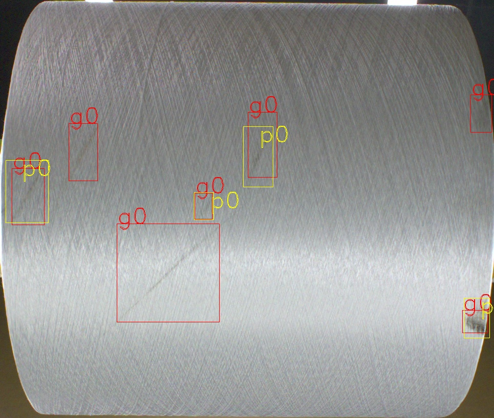

# yolov5_facevisa

内部使用的yolov5训练代码

yolo环境配置和训练
一.说明：
1. yolo5有很多版本，为了转成TensorRT,我们训练yolo的代码只能用gitlab上的: https://gitlab.facevisa.net:1443/machinevision/pytorch_training/-/tree/master/detection/yolov5；
2. pth2wts文件的脚本为 Facevisa_convert_v2.py；
3. 标签格式转换脚本为voc2YOLO.py。

二、环境配置

1.根据镜像（ultralytics/yolov5:v3.0）生成容器，需要指定shm空间大小，否则在运行代码导入数据时会出现错误：DataLoader worker (pid 4024) is killed by signal: Bus error. It is possible that dataloader's workers are out of shared memory. Please try to raise your shared memory limit.下面指定shm空间为8g，如果不指定，则docker默认shm为64M，可使用df -h命令查询
由于110服务器无法用nvidia-docker，直接用docker后续就会出现cuda35错误，因此需要指定gpu参数
创建容器：docker run -it --shm-size 8g --name=yolov5 --gpus all -v /disk3/shishaoyan/:/disk3/shishaoyan/ ultralytics/yolov5:v3.0 /bin/bash

2.下载yolov5代码并解压，下载coco128数据集解压放到yolov5同级目录，下载权重文件至weights文件夹

三、训练

1.执行训练，不指定gpu，则默认使用所有gpu
shell命令（指定1卡2卡训练）：python train.py --img-size 640 --batch 8 --epochs 5 --device 1,2 --data ./data/coco128.yaml --cfg ./models/yolov5s.yaml --weights weights/yolov5s.pt

2.针对自己的数据集：
A、 需要将voc格式转为yolo格式，转换代码见voc2YOLO.py文件，将转换好的文件放置位置如下;

B、 kmeans跑预选框的尺寸大小，以及修改对应yolo配置文件，例如yolov5s.yaml中的anchor的大小，在voc格式的数据及上跑kmeans代码见vockmeans.py文件;

C、 修改coco128.yaml中的类别.

四、模型转换

1.使用转换脚本Facevisa_convert_v2.py进行pth2wts（目前只支持yolov5s），对应修改其中的n、c、h、w、路径及其他参数。
 
五、相关工具介绍

工具一：vis_analysis.py （Facevisa_visAnalysis.sh）对模型的漏检进行可视化分析，会把含有漏检目标的图像按照漏检物体的类别挑选出来的。

如下图，**g0** 表示 标签为0的GT，**p0**表示预测为0的预测结果，下图可以看到3个漏检目标

注意事项， 	iou阈值有两个

- **iou-thres-nms** 用于 NMS阈值
- **iou-thres-pos** 用于和GT对比时，判断prediction的IOU阈值。这个是为了一定程度照顾小目标的检测

工具二：tools/vis_gts.py  对 yolo格式的标注进行可视化，防止制作标签发生错误

